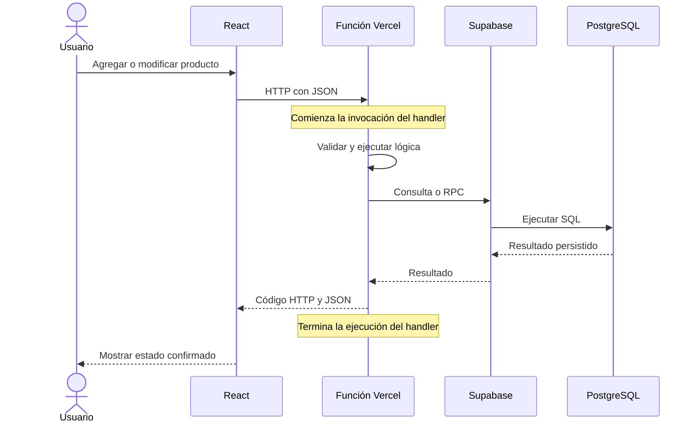

# Trabajo práctico: arquitectura Serverless aplicada a un sistema de stock

## Objetivo

Implementar un sistema que registra, consulta, busca, modifica y elimina productos, con aumentos y disminuciones de stock persistidos en PostgreSQL. Demostrar cómo una solicitud HTTP activa una función Serverless, sin desarrollar un backend que escuche conexiones permanentemente.

## Qué es Serverless

Serverless es un modelo en el que el proveedor administra los recursos que ejecutan nuestro código. En funciones como servicio (FaaS), el desarrollador entrega handlers que se ejecutan ante eventos, por ejemplo una solicitud HTTP. El proveedor gestiona la infraestructura y el ciclo de ejecución.

Sí existen servidores físicos: los administra Vercel. No significa que todo sea gratuito ni que la base de datos deje de necesitar infraestructura. Los costos y límites dependen del plan y uso.

## Componentes y responsabilidades

| Componente | Responsabilidad |
| --- | --- |
| React + TypeScript | Mostrar productos, recibir datos y actualizar la interfaz |
| Vite | Preparar el desarrollo y compilar archivos estáticos |
| Vercel | Publicar el frontend y ejecutar los handlers Node.js |
| Funciones en api/ | Validar solicitudes, ejecutar lógica y devolver JSON |
| Supabase | Exponer una API HTTPS y permisos sobre PostgreSQL |
| PostgreSQL | Mantener los productos y aplicar reglas de integridad |
| Git + GitHub | Versionar el proyecto y activar despliegues desde commits |

Serverless se aplica al **backend**. React no se convierte en una función Serverless por alojarse en Vercel. El frontend compilado se entrega como archivos estáticos. La persistencia está fuera de las funciones.

## Flujo

Usuario
↓
React
↓
HTTP Request
↓
Función Serverless en Vercel
↓
Supabase / PostgreSQL
↓
Respuesta JSON
↓
React actualiza la pantalla

## Eventos y funciones

| Acción del usuario | Evento HTTP | Handler |
| --- | --- | --- |
| Abrir listado o buscar | GET /api/productos | api/productos/index.ts |
| Guardar nuevo producto | POST /api/productos | api/productos/index.ts |
| Consultar un ID | GET /api/productos/:id | api/productos/[id].ts |
| Guardar edición | PUT /api/productos/:id | api/productos/[id].ts |
| Confirmar eliminación | DELETE /api/productos/:id | api/productos/[id].ts |
| Confirmar aumento/disminución | PATCH /api/productos/:id/stock | api/productos/[id]/stock.ts |

Hay seis operaciones y tres entradas Serverless. Cada archivo puede atender distintos métodos HTTP. El handler comienza cuando Vercel recibe y enruta la solicitud; valida, espera la operación de Supabase, responde y retorna. Una solicitud inválida también termina, con un error HTTP.

No hay Express, Docker, app.listen() ni un bucle que mantenga un backend propio escuchando. Vercel puede conservar o reutilizar un entorno de ejecución; no prometemos que destruya físicamente la instancia después de cada solicitud. Ningún estado en memoria se utiliza para persistir el inventario.

## Datos y reglas

La tabla productos contiene id UUID y fecha_creacion automáticos, nombre obligatorio, descripción, categoría, precio decimal no negativo y stock entero no negativo.

La UI muestra **Sin stock** con 0, **Stock bajo** entre 1 y 5, y **Disponible** por encima de 5. Cero tiene prioridad porque también satisface stock <= 5.

Las reglas se verifican en el formulario, el backend y PostgreSQL. Las búsquedas son por coincidencia parcial de nombre, sin distinguir mayúsculas. Los comodines se escapan. La lista recorre páginas para evitar truncar silenciosamente el inventario por el límite de Supabase; para inventarios grandes convendría paginación visible.

## Stock y concurrencia

actualizar_stock es una función **SQL de PostgreSQL**, no otra función Serverless de Vercel. El handler Serverless la invoca con Supabase RPC. PostgreSQL realiza UPDATE stock = stock + delta condicionado a que el resultado sea válido. Esta sentencia bloquea la fila durante la escritura y evita el patrón peligroso de leer, calcular en JavaScript y luego sobrescribir.

La edición completa incluye expected_stock, el stock que se mostraba al abrir el formulario. El UPDATE exige que el stock todavía coincida; si cambió, responde 409 y el usuario debe cerrar el formulario, actualizar la lista y volver a editar. Esto protege cambios concurrentes de stock. No implementa versionado de todos los campos ni un historial de movimientos.

React espera la respuesta y vuelve a consultar la lista. No modifica el stock únicamente en estado local. Si falla la consulta posterior, muestra un aviso y conserva los últimos datos, sin ocultar el error.

## Errores y configuración

201 identifica una creación; 200 una operación exitosa; 400 datos inválidos; 404 producto inexistente; 405 método inválido; 409 stock insuficiente o conflicto; 415 formato de body incorrecto; 503 configuración ausente; 500 error interno.

El backend utiliza SUPABASE_URL y SUPABASE_SERVICE_ROLE_KEY. La clave nunca llega a React ni se almacena en Git. RLS bloquea el acceso directo con claves públicas; las funciones de esta demostración son públicas y no incluyen autenticación. Un inventario privado requiere autenticar y autorizar usuarios en el backend.

## Ventajas y límites

La arquitectura reduce el mantenimiento de un servidor propio y organiza cada operación alrededor de solicitudes. Permite que Vercel gestione la ejecución según su plataforma. A cambio, hay límites de duración, cuotas, posibles arranques en frío y dependencia de Vercel/Supabase. Una función no sirve para guardar estado permanente: ese papel corresponde a PostgreSQL.

> El sistema utiliza arquitectura Serverless en el backend. Cada vez que el usuario realiza una operación sobre el stock, el frontend envía una solicitud HTTP que activa una función Serverless en Vercel. La función ejecuta la lógica necesaria, accede a PostgreSQL mediante Supabase, devuelve una respuesta al frontend y finaliza su ejecución.
